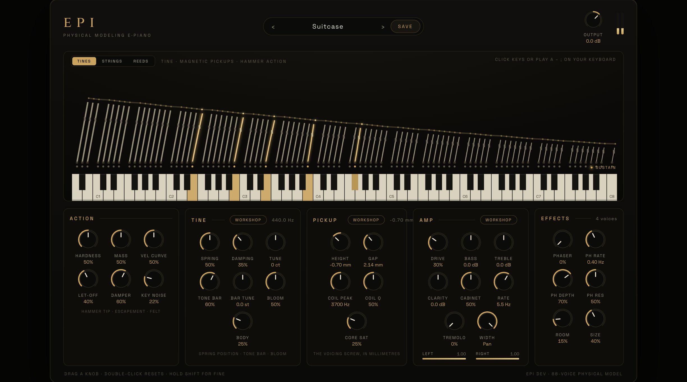
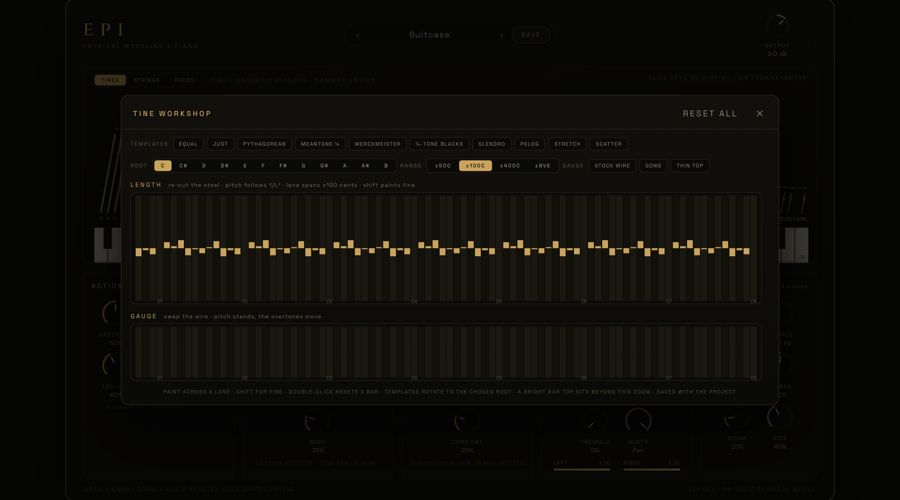

# Epi

### Three electric pianos, built from physics — no samples anywhere

**Tine · E-Grand · Reed** — VST3 · AU · CLAP · Standalone

## What this is

Epi computes every note from the physics of the instrument: a hammer strikes
a piece of steel, the steel rings, and a transducer turns its motion into an
electrical signal. There is no sample library and no oscillator standing in
for one — when you change the hammer, the pickup, or the steel itself, the
sound changes the way it would on the real bench.

Three instruments live behind one selector:

- **Tine** — the classic tine piano: 88 tuned steel rods with tone bars,
  magnetic pickups, and the stereo panner its amplifier called vibrato. The
  harmonics come from the pickup's field, not the metal — which is why the
  pickup HEIGHT knob re-voices the instrument the way the real voicing screw
  does, and why playing harder growls instead of just getting louder.
- **E-Grand** — the electric stage grand: real strings on a rigid bridge
  with a piezo pickup that reads string force, a mid-scooped preamp, and the
  long singing sustain that made these tour.
- **Reed** — the reed piano: solder-tuned steel tongues over an
  electrostatic pickup polarised at 150 volts. The louder you play, the more
  the gap's asymmetry barks — that snarl is the geometry of the pickup, and
  the SUPPLY knob is a real voltage.

Every voice is its own mechanism. All 88 notes have their own hammer, their
own resonator, their own pickup — chords never steal voices, repeated notes
meet steel that is already moving, and the sustain pedal wakes the whole
harp sympathetically.

## The workshops

The panel gets you the classic sounds. The workshops let you rebuild the
instrument.

- **Tine / String workshop** — re-cut any note's steel. The LENGTH lane
  retunes by the beam and string equations (paint microtonal scales by hand,
  or apply just intonation, Pythagorean, quarter-comma meantone,
  Werckmeister III, slendro, pelog, an octave stretch, or a barroom scatter
  with one click, rotated to any root). The GAUGE lane swaps the wire:
  pitch stands, and the overtone character moves — fat wire turns the tine
  bank into gongs and the grand's strings bell-like.
- **Pickup workshop** — every pickup gets its own height, gap, and winding.
  Three tolerance templates paint the manufacturing scatter of a well-kept,
  worn, or neglected instrument — deterministic, so your instrument is the
  same one every session.
- **Cabinet workshop** — a speaker with dimensions instead of an impulse
  response: box volume sets the resonance, cone size sets the breakup, the
  microphone has distance and angle, and the suspension decides when it
  grinds. Five cabinets ship as one-click starting points.

Everything the workshops hold is saved in your project **and inside every
preset you save** — a saved sound is the whole sound.

## Playing it

- Click the drawn keys (deeper on the key is louder) or play A–; on your
  computer keyboard — or just send it MIDI, including sustain (CC64),
  expression (CC11), and pitch bend.
- The visualizer is telemetry, not animation: every rod swings at its true
  frequency by the measured amount, hammers fire when the engine strikes,
  and a SUSTAIN lamp shows the pedal state your keyboard is actually
  sending.
- BASS, TREBLE, and CLARITY are the channel strip; DRIVE and CORE SAT (or
  SUPPLY, on the reed piano) are where the dirt lives, because that is
  where it lives on the instruments.

## Install

Grab the zip for your platform from
[Releases](../../releases), unzip, and copy the plugin bundles to your
plugin folder (an INSTALL.txt with the exact paths is inside each zip).

macOS builds are unsigned: right-click → Open the standalone once, or run
`xattr -cr` on the bundles, and your DAW will load them.

Formats by platform, exactly as CI ships them:

| | VST3 | AU | CLAP | Standalone |
|---|---|---|---|---|
| macOS (universal) | yes | yes | yes | yes |
| Windows (x64) | yes | – | yes | yes |
| Linux (x64) | yes | – | yes | yes |

Building from source needs CMake ≥ 3.22 and a C++20 compiler; JUCE is a
submodule. `cmake -S . -B build && cmake --build build --target Epi_All`.

## How honest is "physical"?

Measured, not asserted. The models are calibrated against recordings of the
real instruments and against the published measurements of the people who
put them under high-speed cameras and spectrum analysers — and the repo
carries the receipts: six test suites (130+ numbered rows) render audio
offline and measure it, from inharmonicity curves and per-partial decay
rates to "a chord must equal the sum of its notes on the piezo bridge, and
must NOT on a coupled soundboard". `docs/` holds the implementation plans
and the research notes with every number's provenance.

The repository also contains **Didge**, a physically modeled didgeridoo
built on the same engine discipline — see [docs/didge.md](docs/didge.md).

## Trademarks

Fender, Rhodes, Wurlitzer, and Yamaha are trademarks of their respective
owners. Epi is not affiliated with, endorsed by, or sponsored by any of
them; their names appear only in the documentation, factually, to identify
which instruments were measured.

## License

GPL-3.0. The DSP is plain C++ headers with the physics explained in the
comments — if you want to know why a knob does what it does, the answer is
in the file, usually with the measurement that decided it.
